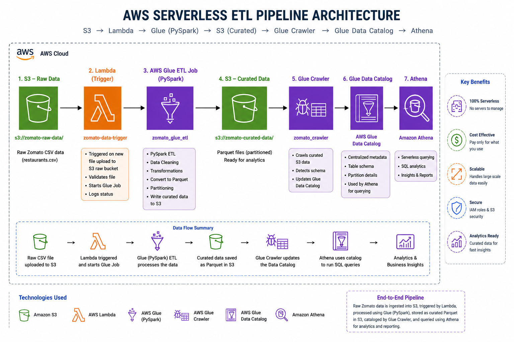

AWS Serverless Data Engineering Pipeline:
----------------------------------------
An AWS-based serverless ETL pipeline for processing Zomato restaurant data using Amazon S3, AWS Lambda, AWS Glue with PySpark, AWS Glue Crawler, AWS Glue Data Catalog, and Amazon Athena.

Project Overview:
-----------------
This project demonstrates an end-to-end cloud data engineering workflow in which raw restaurant data is stored in Amazon S3, an S3 event triggers an AWS Lambda function, and the Lambda function starts an AWS Glue ETL job.

The Glue ETL job uses PySpark to clean, transform, and analyze the restaurant dataset before writing curated datasets in Parquet format to Amazon S3. AWS Glue Crawler is then used to discover the schema and create metadata in the Glue Data Catalog. Amazon Athena uses the cataloged tables to perform SQL-based analytical queries.

Architecture:
-------------


Data Flow:
----------
```text
Raw CSV Data
     |
     v
Amazon S3
     |
     | S3 Object Event
     v
AWS Lambda
     |
     | Starts Glue Job
     v
AWS Glue ETL
(PySpark)
     |
     | Data Cleaning & Transformation
     v
Amazon S3
(Curated Parquet Data)
     |
     v
AWS Glue Crawler
     |
     v
AWS Glue Data Catalog
     |
     v
Amazon Athena
(SQL Analytics)

AWS Services Used:
------------------

| Service | Purpose |
|---|---|
| Amazon S3 | Stores raw input data and curated output datasets |
| AWS Lambda | Provides event-driven automation and starts the Glue ETL job |
| AWS Glue | Performs serverless ETL processing using PySpark |
| AWS Glue Crawler | Discovers the schema of curated datasets |
| AWS Glue Data Catalog | Stores table metadata and schemas for querying |
| Amazon Athena | Performs SQL-based analytics on cataloged data |
| AWS IAM | Provides permissions for AWS resources and services |

ETL Process:
------------
1. Data Ingestion

Raw Zomato restaurant data is stored in Amazon S3 as a CSV dataset.

2. Event-Driven Trigger

When a new object is uploaded to Amazon S3, an S3 event invokes the AWS Lambda function.

The Lambda function reads the S3 event, extracts the bucket and object key, and starts the AWS Glue ETL job with the required input and output paths.

3. Data Processing with AWS Glue and PySpark

The AWS Glue ETL job reads the CSV data from Amazon S3 using PySpark.

The transformation process includes:

- Schema inference
- Column renaming
- Removing unnecessary spaces using `trim()`
- Handling null values
- Data type conversion
- Filtering invalid records
- Creating rating categories
- Data aggregation
- Sorting analytical results

4. Rating Categorization

Restaurant dining ratings are categorized into:

- Excellent
- Very Good
- Good
- Average

5. Curated Data Generation

The transformed data is written to Amazon S3 in Parquet format.

The pipeline generates:

- Cleaned Zomato data
- Area summary
- Cuisine summary
- Top restaurants

6. Glue Crawler and Data Catalog

AWS Glue Crawler scans the curated S3 datasets and discovers their schemas.

The crawler creates tables in the Glue Data Catalog:

- `cleaned_zomato_data`
- `area_summary`
- `cuisine_summary`
- `top_restaurants`

7. Data Analysis with Amazon Athena

Amazon Athena is used to query the cataloged datasets using SQL.

Example analysis includes:

- Restaurant counts by area
- Average dining ratings
- Restaurant counts by cuisine
- Top-rated restaurants

Project Structure:
-----------------
```text
aws-serverless-data-engineering-pipeline/
│
├── .gitignore
├── README.md
│
├── architecture/
│   └── aws-pipeline-architecture.png
│
├── glue/
│   └── zomato_glue_etl.py
│
├── lambda/
│   └── lambda_function.py
│
├── screenshots/
│
└── sql/
    └── athena_queries.sql

Key Data Engineering Concepts:
-----------------------------
Cloud-based ETL
Serverless data engineering
Data ingestion
Event-driven pipelines
Data cleaning
Data transformation
Data aggregation
PySpark DataFrame processing
Parquet data format
AWS Glue ETL
AWS Glue Crawler
AWS Glue Data Catalog
Amazon Athena SQL analytics
AWS Lambda automation
Amazon S3
IAM-based access control
Python
Boto3
Git and GitHub

Technologies:
------------

Cloud: AWS

AWS Services: Amazon S3, AWS Glue, AWS Lambda, AWS Glue Crawler, AWS Glue Data Catalog, Amazon Athena, IAM

Programming & Processing: Python, PySpark, Apache Spark, Boto3

Database & Query: SQL

Data Format: CSV, Parquet

Version Control: Git, GitHub

Project Outcome:
----------------

This project demonstrates an end-to-end serverless AWS data engineering workflow covering data ingestion, event-driven processing, ETL transformation, curated data storage, metadata discovery, and SQL-based analytics.

Security:
---------

No AWS credentials, access keys, secret keys, private keys, passwords, or GitHub tokens are stored in this repository.

Sensitive files such as .pem, .env, credential files, and Python cache files are excluded through .gitignore.